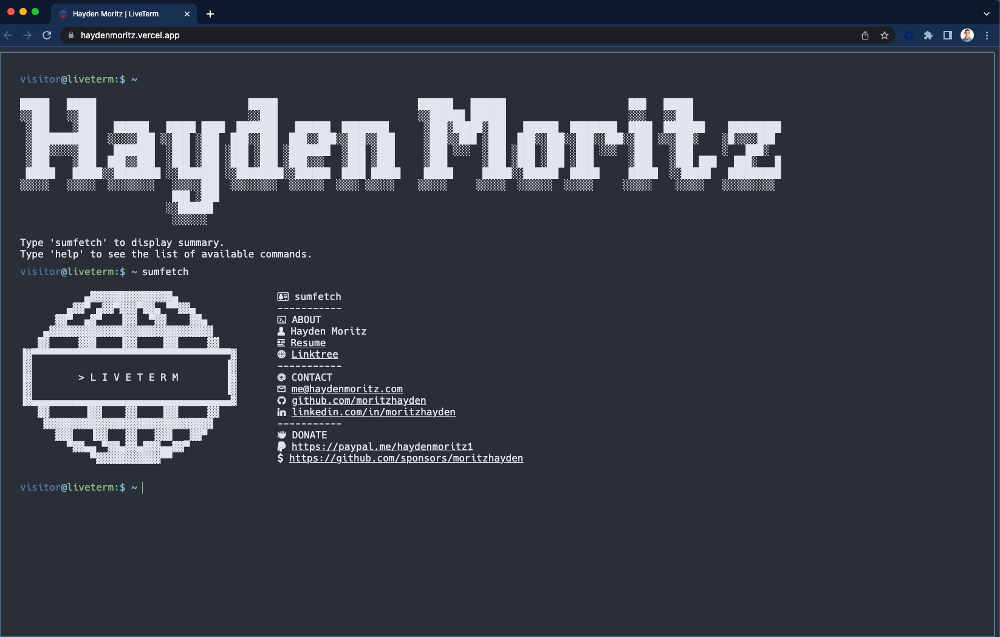

# [💻 LiveTerm - build terminal styled websites in minutes!](https://liveterm.vercel.app)

This repo hosts the code for my online "LiveTerm" website! Feel free to look around.

## 📸 Showcase

<p align="center">
<br>
<strong><a href="https://haydenmoritz.vercel.app/" target=_blank>My LiveTerm Instance</a></strong>
</p>

## 🚀 Local Setup

### Using Yarn

LiveTerm requires the `yarn` package manager. You can install `yarn` [here](https://classic.yarnpkg.com/lang/en/docs/install/).

Simply run the following commmands in your terminal:

```bash
$ git clone https://github.com/MoritzHayden/LiveTerm.git && cd LiveTerm

$ yarn install && yarn dev
```

### Using Docker

First, clone the project and edit `config.json` to your liking. Then run the following to start the container in the background:

```shell
docker-compose up -d
```

If you **know** what you were doing, you can also try changing `Dockerfile` & `docker-compose.yml`!
Learn more about Docker [here](https://docs.docker.com/get-started/overview/ 'here').

## Commands

The following commands are available:
```
banner
cd
date
donate
echo
email
github
help
linkedin
ls
mkdir
projects
quote
readme
resume
sudo
sumfetch
weather
whoami
```

## 🌐 Deployed on Vercel

Access the site on Vercel here: https://haydenmoritz.vercel.app/

## Credit

Forked from Cveinnt's [LiveTerm](https://github.com/Cveinnt/LiveTerm).
